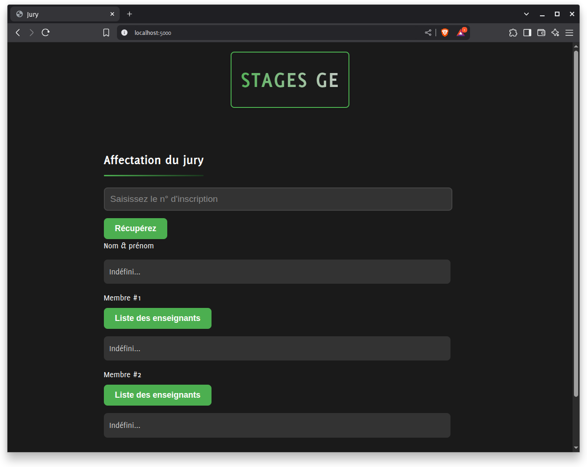

# Serveur web pour l'affectation des jurys  #

On récupère les informations des étudiantes depuis une base des données définie et on assigne des jurys de soutenance en conséquence.

Ce programme est fourni sous licence **MIT** - Voir le fichier [LICENSE](LICENSE) pour plus de détails. 
